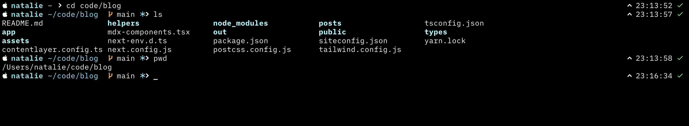

# paramour
simple and clean zsh theme, sort of based off the default zsh look.

you will need a nerd font, or else the prompt will look like this (assuming you don't have a nerd font set as default in your browser): 

```
 natalie ~                                                    23:25:22 127 
```

### looks like this

